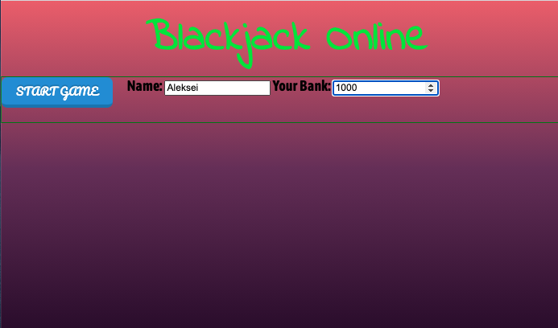
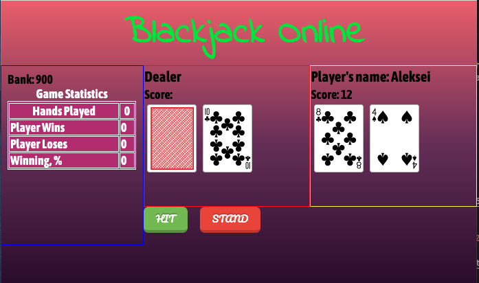
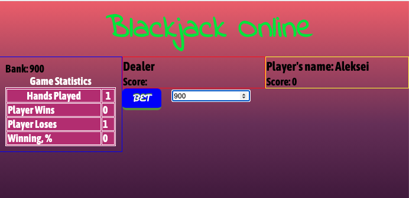
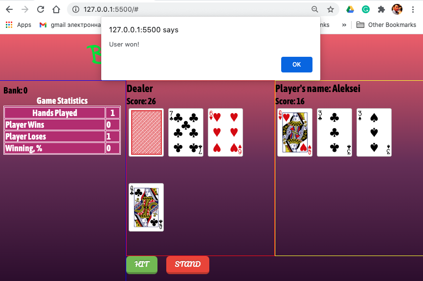
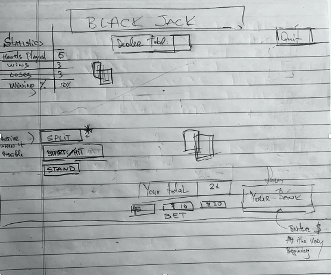

# game-project
SEI 10-19 Project 01: Broweser Game

# Blackjack Online
==================

Please welcome my first game ever made called Blackjack Online.   

I like gambling and everything related to **Las Vegas**. This is was the first city I've visited in the **United States** and I was inspired by special atmosphere. Since that time, I’ve enjoy playing Blackjack, so my choice was obvious.

### Game Rules

* Get 21 points on the player's first two cards (called a "blackjack" or "natural"), without a dealer blackjack.
* Reach a final score higher than the dealer without exceeding 21; 
* Let the dealer draw additional cards until their hand exceeds 21;

1. Screenshot(s)

2. Technologies Used

* HTML for my basic, underlying structure
* CSS3 for styling and transforms
* Javascript

3. Getting Started

Initially, I started wireframing how I wanted the final board to look like and wrote a pseudocode with the game logic. (please see below):

   

                              
4. At this work I used the following sources:
 
* Cards templates and shuffled functions special thanks to GA team [Cards Templates](http://repl.it/@MichaelSiller/Use-CSS-Card-Library#index.html)
*  [Fancy Buttons](http://codepen.io/topic/buttons/picks)
*  MDN, Stack Overflow, CSS-Tricks and etc.
 
Player can find the game [Blackjack Online](https://aleksyara.github.io/game-project)

5. Next Steps:

Unfortunately, some essential functionality haven’t been included in this game so I’m planning to add following in the future: 

* Make a DRY code and re-write render function;
* Create a SPLIT, DOUBLE DOWN, and INCURACE buttons, 
* Add opportunity Aces are worth 1 or 11, whichever makes a better hand.
* Make a style looks like 8-bit style
* Link the sound/music files
